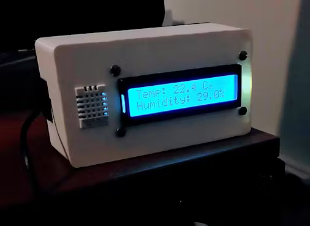

# Temperature and humidity sensor

Simple Temperature and humidity meter using ATmega328, LCD display and DHT22 sensor.

Project repository: https://github.com/mimimaki/thsensor

## Hardware

* ATmega328
    * 16MHz Crystal
    * 2x 22pF Capacitor
    * 2x 10kOhm resistor
* DHT22 Temperature Sensor
* 16x2 RGB LCD Display
* MC78L05 Voltage Regulator
    * 100nF Capacitor
    * 330nF Capacitor
* 9V battery
    * Slide switch
    * 10uF Capacitor

## Casing

STL files are included in the casing file.

## Arduino code

The code uses non-traditional library dht_nonblocking (https://github.com/olewolfDHT_nonblocking by wolf@blazingangles.com) as this enables you to read sensor values from the DHT22 temperature and humiditiy sensors without blocking other code execution. The program simply reads the sensor values and prints them on the LCD screen.

## Author

Written initially by [Miikka Mäki (git: mimimaki)](https://github.com/mimimaki), 10th July 2022. Documentation ported to github in 10th August 2024.

## License
MIT License, see LICENSE.